# localmind Architecture Diagrams

This file is a visual map of the current `localmind-rag` scaffold. The diagrams describe what exists now and where the next implementation stages should plug in.

## Monorepo Map

```mermaid
flowchart TB
    Repo["localmind-rag"]

    Repo --> Desktop["apps/desktop<br/>Tauri + React UI"]
    Repo --> Backend["backend<br/>.NET solution"]
    Repo --> Runtime["runtime<br/>portable data + AI assets"]
    Repo --> Infra["infra<br/>remote sync dependencies"]
    Repo --> Docs["docs<br/>architecture notes"]
    Repo --> Scripts["scripts<br/>setup/check/dev/package"]
    Repo --> CI[".github/workflows<br/>CI gates"]

    Desktop --> DesktopSrc["src<br/>FSD frontend"]
    Desktop --> TauriCfg["src-tauri<br/>sidecar config"]

    Backend --> LocalApi["KnowledgeApp.LocalApi"]
    Backend --> SyncApi["KnowledgeApp.SyncApi"]
    Backend --> Worker["KnowledgeApp.Worker"]
    Backend --> Domain["KnowledgeApp.Domain"]
    Backend --> Application["KnowledgeApp.Application"]
    Backend --> Infrastructure["KnowledgeApp.Infrastructure"]
    Backend --> Contracts["KnowledgeApp.Contracts"]
    Backend --> Bootstrap["KnowledgeApp.Bootstrap"]
    Backend --> Tests["Unit / Integration / Architecture tests"]

    Runtime --> AppRuntime["runtime/app<br/>data files indexes logs"]
    Runtime --> AiRuntime["runtime/ai<br/>bin models"]
```

## Desktop Runtime Boundary

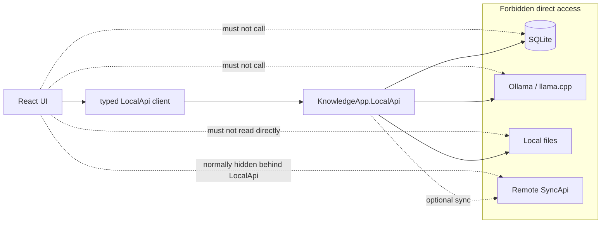

## Backend Project Dependencies

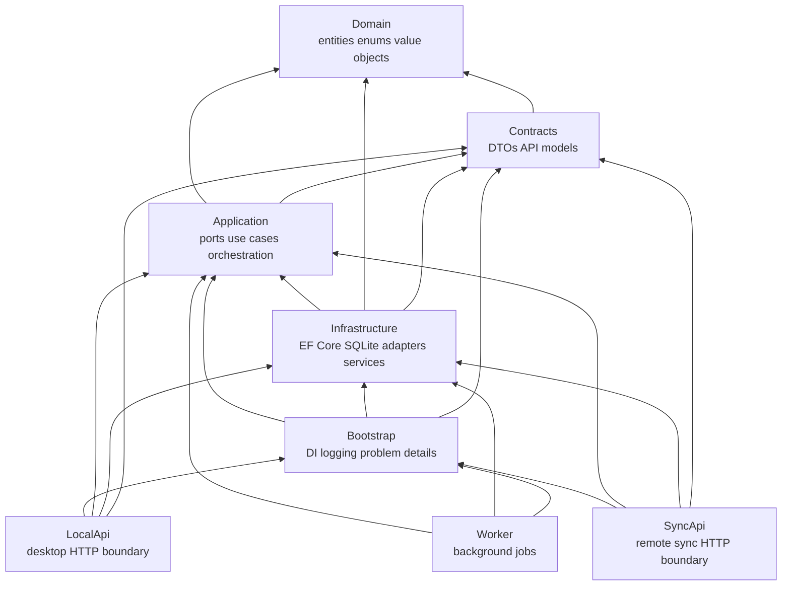

## LocalApi Startup

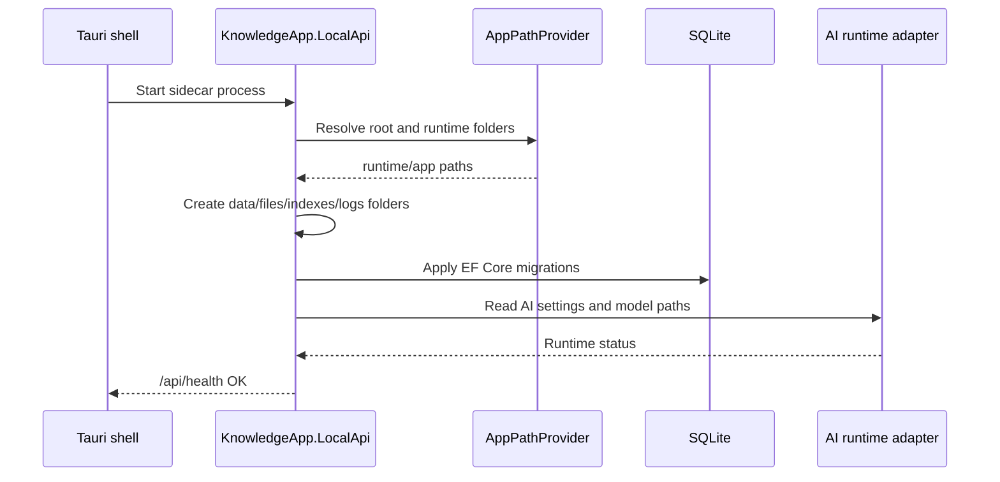

## Local SQLite Schema

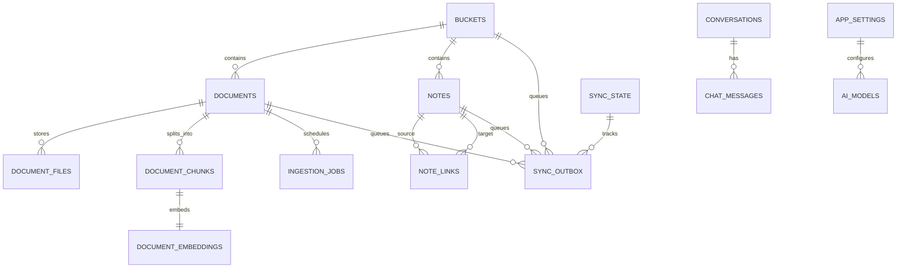

## RAG Components

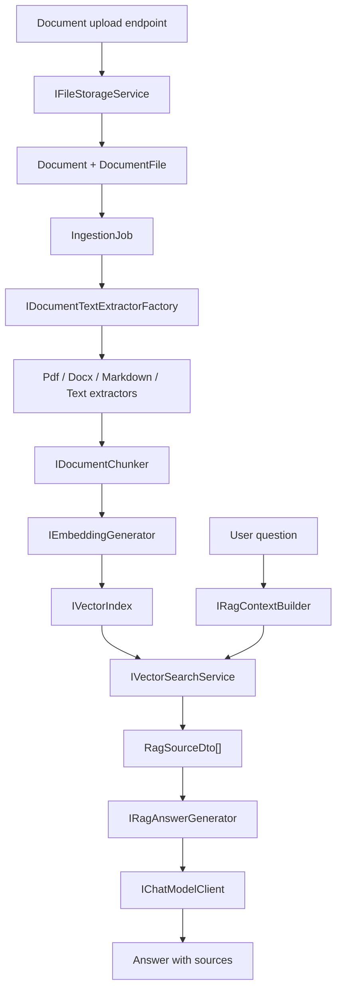

## Frontend Feature Slices

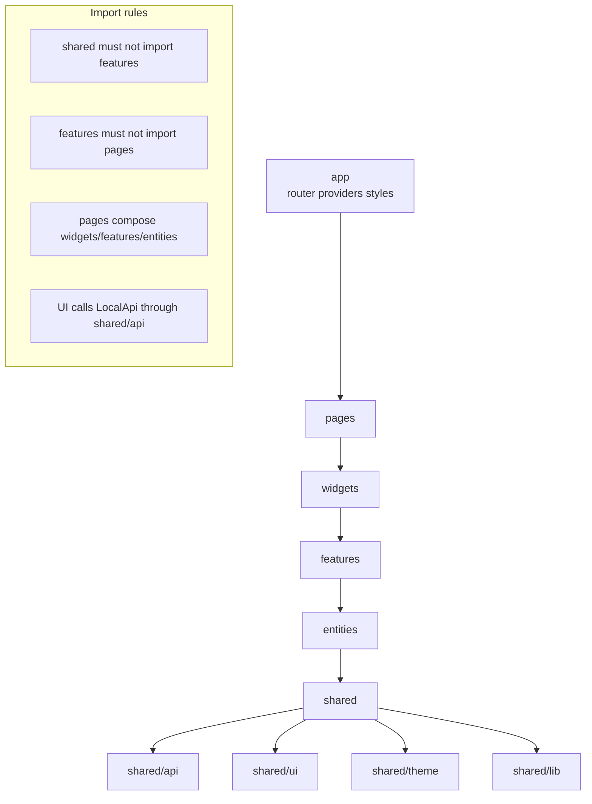

## Development Flow

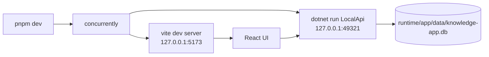

## Quality Gates

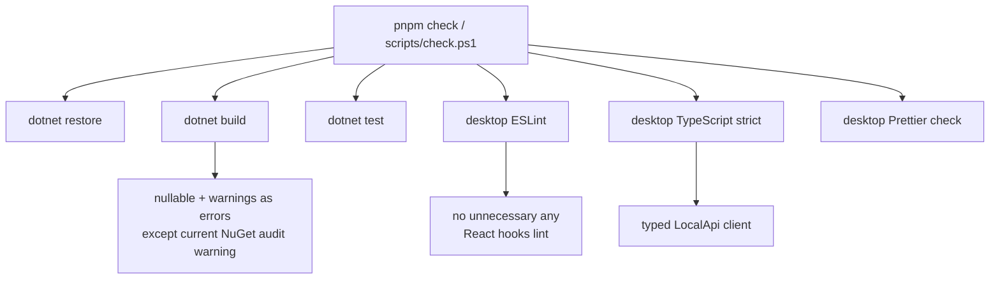

## Portable Packaging Target

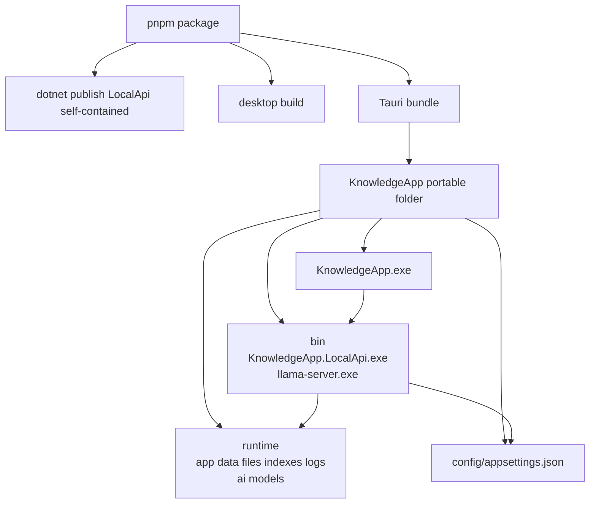

## Remote Sync Ownership

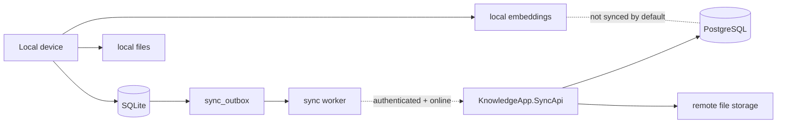
