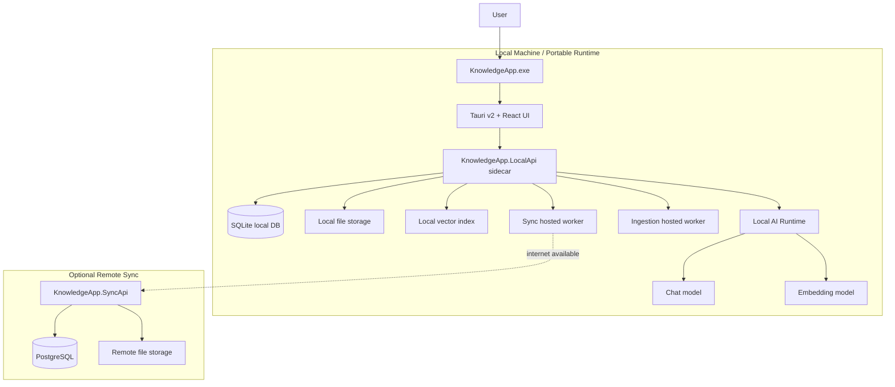
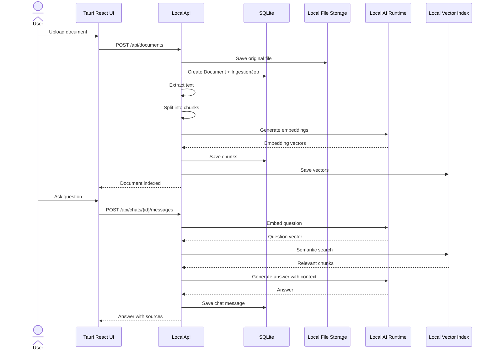
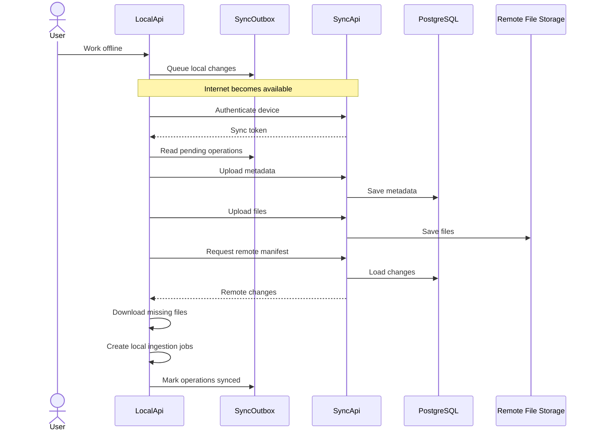
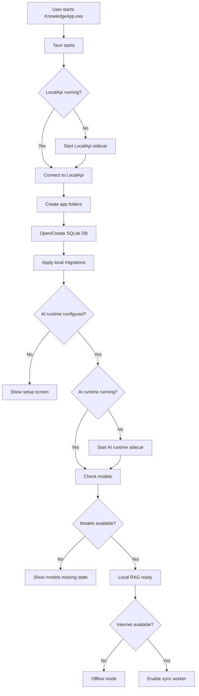
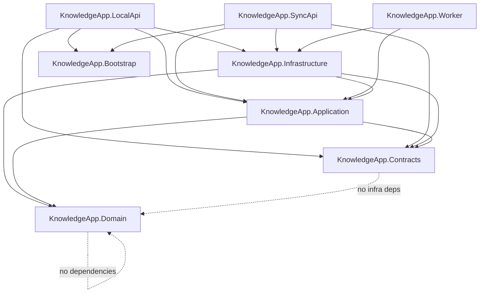
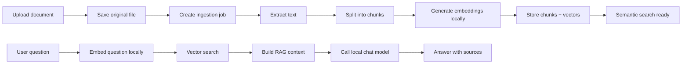
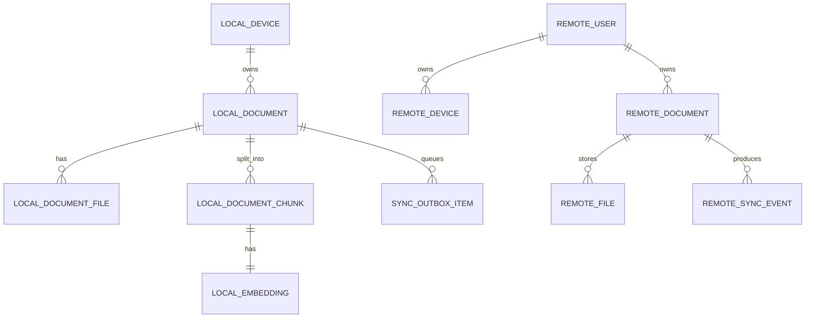
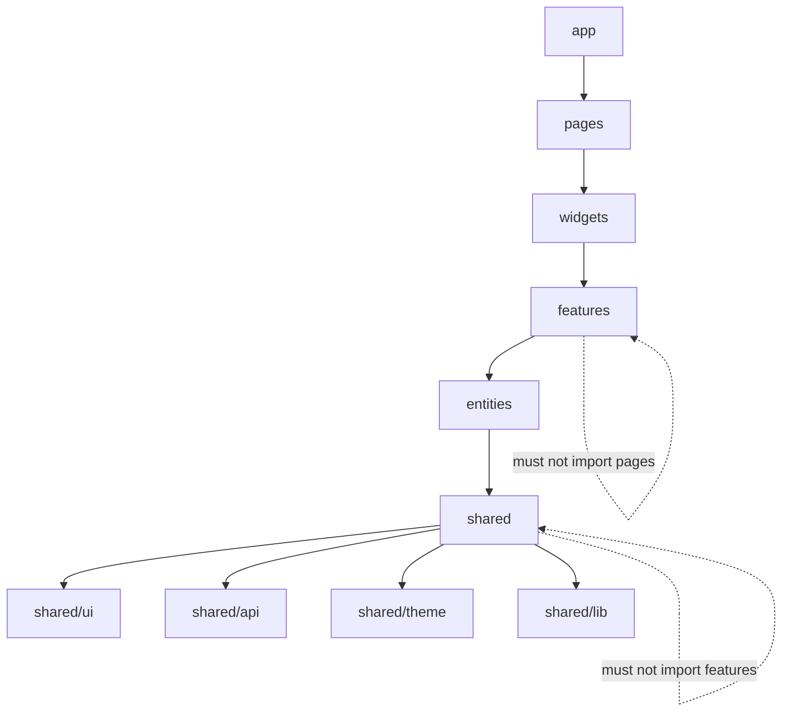
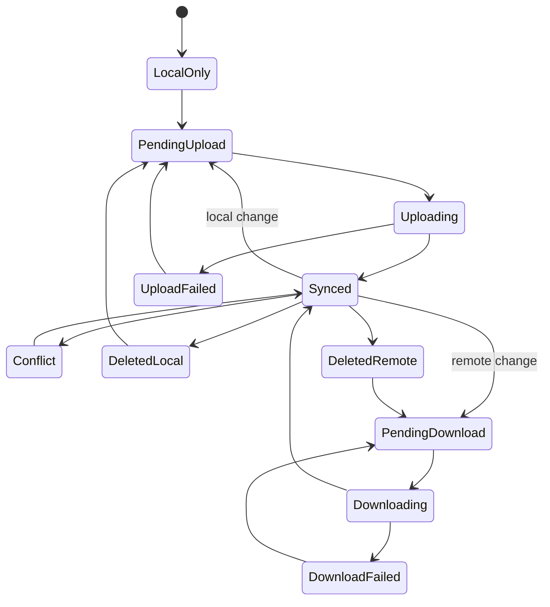

# Knowledge App Architecture

## Overall architecture

## Offline mode

## Online sync

## Application startup lifecycle

## Backend Clean Architecture dependencies

## RAG pipeline

## Data ownership

## Frontend feature-sliced structure

## Sync state machine

