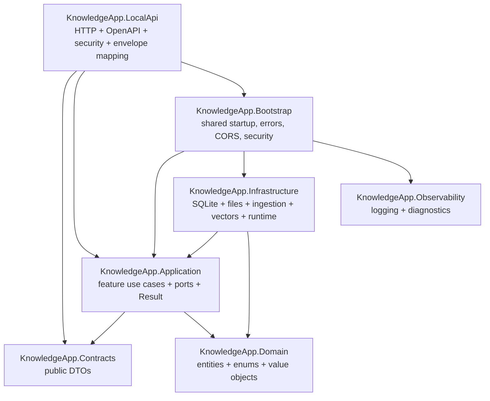

# Backend Architecture

The backend is a modular monolith with Clean Architecture project boundaries. It is one deployable local sidecar, but code is organized by business feature and adapter responsibility.

## Project Rules

- `Domain` has no dependency on Application, Infrastructure, LocalApi, SyncApi, or EF Core.
- `Application` owns commands, queries, validators, mappers, `Result<T>`, application errors, and ports.
- `Infrastructure` implements application ports for SQLite, file storage, ingestion, vector search, embeddings, AI runtime, diagnostics, and sync skeletons.
- `LocalApi` owns HTTP only: route mapping, request parsing, OpenAPI metadata, security middleware, and conversion through `ApiResults`.
- `Contracts` owns request and response DTOs that are public LocalApi contracts and DocFX/OpenAPI inputs.

## Feature Map

Feature folders are the canonical navigation model:

| Feature | LocalApi | Application | Contracts |
| --- | --- | --- | --- |
| Buckets | bucket endpoints | bucket handlers/resolvers | bucket DTOs |
| Documents | upload/list/get/reindex/delete | document commands, queries, validation | document DTOs |
| Ingestion | job list/get/process/retry/cancel | lifecycle handlers and mapper | ingestion job DTOs |
| Search/RAG | content, semantic, chat answer | search/chat handlers | search and RAG DTOs |
| Chats/Notes | CRUD-style local workflows | feature handlers | feature DTOs |
| Runtime | status/setup/start/models/providers | runtime ports | runtime DTOs |
| Settings/Diagnostics/Sync | local state endpoints | feature services | runtime/settings DTOs |

## Current Backend Invariants

- Expected failures use `Result<T>` or `Result` and stable error codes.
- LocalApi endpoints return `ApiResponse<T>` envelopes except documented exemptions.
- Ingestion is job-backed and exposes lifecycle state, progress, retry/cancel affordances, and sanitized diagnostics.
- Runtime-specific behavior is hidden behind provider contracts; llama.cpp is the first provider.
- LocalApi is loopback-first and can require a local token for mutating endpoints.

Related decisions live in [Architecture Decisions](./decisions/README.md).
