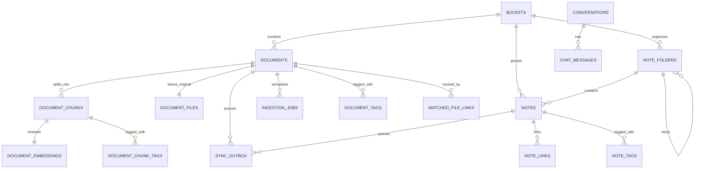

# Data And Storage

LocalMind persists user data locally by default. SQLite stores structured application state, uploaded source files live in managed runtime folders, and embeddings stay local behind vector-search interfaces.



## SQLite

SQLite is the local database for buckets, documents, notes, chats, ingestion jobs, settings, diagnostics state, sync state, chunks, and embeddings. EF Core migrations own schema changes.

| Table | Purpose |
| --- | --- |
| `buckets` | User-created document/note grouping. |
| `documents`, `document_files` | Document metadata and managed local file references. |
| `ingestion_jobs` | Durable ingestion lifecycle, progress, retry/cancel state, and sanitized failures. |
| `document_chunks`, `document_embeddings`, `document_chunks_fts` | Searchable chunks, local embedding vectors, and SQLite FTS/BM25 keyword index rows. |
| `document_tags`, `document_chunk_tags` | Tag labels on documents and individual chunks. |
| `notes`, `note_links`, `note_tags` | Local notes, inter-note relationships, and note tag labels. |
| `note_folders` | Hierarchical folder tree for organizing notes within a bucket. |
| `conversations`, `chat_messages` | RAG chat history with title generation tracking. |
| `app_settings` | Local settings such as selected bucket, runtime preferences, and watched-folder configuration. |
| `watched_file_links` | Tracks files discovered by the folder watcher and their ingestion links. |
| `ai_models` | Locally registered AI model metadata (name, path, provider). |
| `local_devices` | Device identity for optional sync and multi-device tracking. |
| `semantic_cache_entries` | Cached embedding lookup results for repeated queries. |
| `operation_logs` | Structured log of key operations for diagnostics and audit. |
| `sync_state`, `sync_outbox` | Local sync skeleton state. |

## Files And Indexes

SQLite stores the FTS virtual table in the local database. Portable mode stores runtime files under `runtime/app`:

```text
runtime/app/data      SQLite database
runtime/app/files     uploaded source files
runtime/app/indexes   local vector/search indexes
runtime/app/logs      local logs and diagnostic events
```

Uploads are copied into `runtime/app/files/{documentId}/` with sanitized file names. The app does not expose arbitrary disk import paths through LocalApi.

## Offline Mode

Documents, chunks, embeddings, notes, chats, and settings are available offline. Remote sync is a separate future boundary and does not own local-first behavior.
