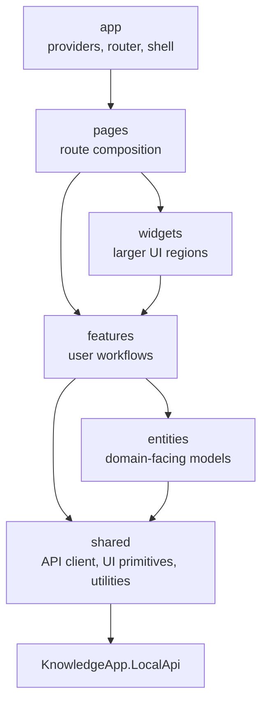

# Frontend Architecture

The desktop frontend is a Tauri React app organized with feature-sliced boundaries.

## Rules

- Frontend code calls only LocalApi through `apps/desktop/src/shared/api`.
- Pages compose feature public APIs; feature hooks own API orchestration and mutation flows.
- Runtime providers are never called directly from the frontend.
- API responses are unwrapped by the shared `request<T>` helper, which returns `data` or throws the standard `ApiError`.
- TypeScript API mirrors live near entities and shared API modules until generated frontend types are introduced.

See [Frontend contracts](./frontend-contracts.md) for DTO mirroring rules.
