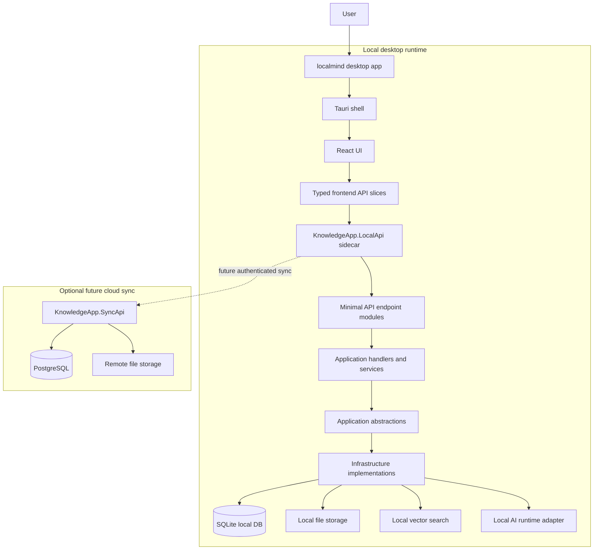
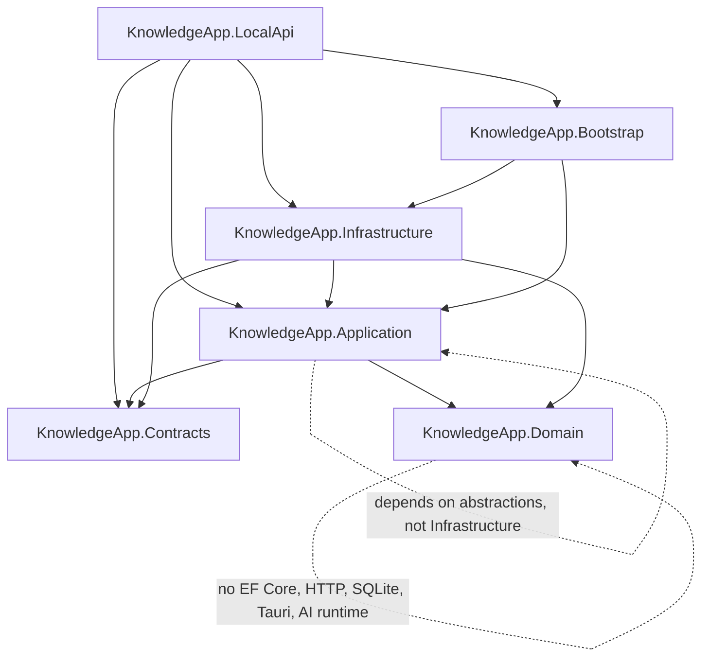
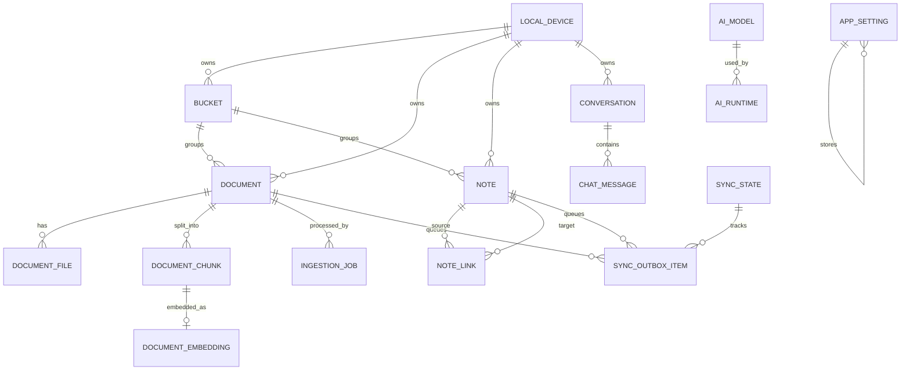
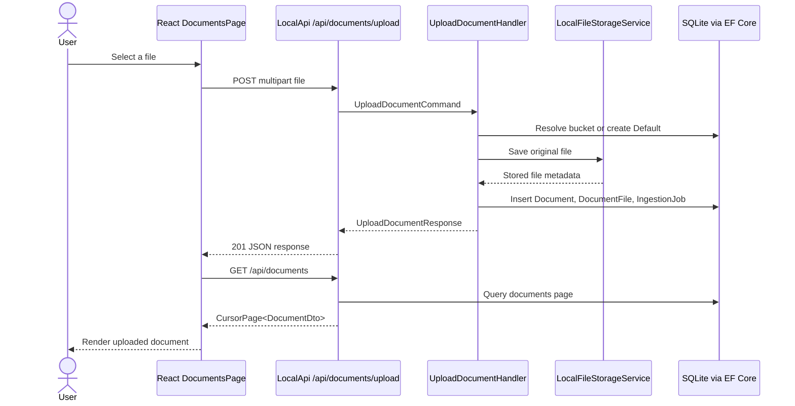
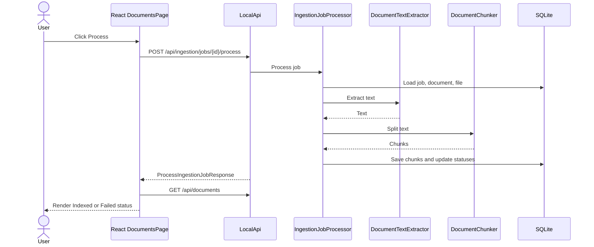
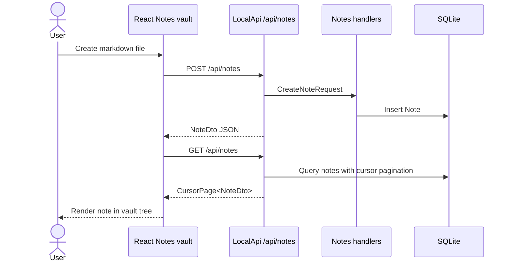

# MVP Architecture And Walking Skeleton

This document describes the current `localmind` MVP architecture, the local database model, and the implemented walking skeleton that proves end-to-end data flow through the desktop UI, local API, application layer, infrastructure, and SQLite database.

## Scope

The current MVP is focused on the local offline-first desktop experience:

- Tauri desktop shell with React UI.
- Local ASP.NET Core API sidecar.
- SQLite local database.
- Local file storage.
- Document upload and ingestion pipeline.
- Notes workspace.
- Diagnostics and runtime status.

The remote sync API exists as a project skeleton, but full remote architecture is out of scope for this MVP documentation because cloud sync is not fully implemented yet.

## Basic Architecture



## Backend Layering

The backend follows Clean Architecture boundaries:



Current code locations:

- Desktop UI: `apps/desktop/src`
- Tauri shell: `apps/desktop/src-tauri`
- Local API: `backend/src/KnowledgeApp.LocalApi`
- Application layer: `backend/src/KnowledgeApp.Application`
- Infrastructure: `backend/src/KnowledgeApp.Infrastructure`
- Domain entities: `backend/src/KnowledgeApp.Domain`
- Contracts: `backend/src/KnowledgeApp.Contracts`

## Local Database ER Diagram

SQLite is the main MVP database. It stores local documents, files, chunks, notes, chat history, ingestion jobs, sync outbox state, diagnostics-related runtime data, and settings.



## Main SQLite Tables

| Table | Purpose |
| --- | --- |
| `local_devices` | Local device identity and ownership boundary for offline-first data. |
| `buckets` | User-facing grouping/folder concept for documents and notes. |
| `documents` | Document metadata, status, sync status, ownership, and bucket relation. |
| `document_files` | Stored original file metadata, local path, file type, hash, and size. |
| `document_chunks` | Extracted text chunks used by search and RAG. |
| `document_embeddings` | Embedding vectors stored locally as BLOBs. |
| `ingestion_jobs` | Pending/processing/chunking/embedding/indexed/failed/cancelled document processing jobs with progress and sanitized diagnostics. |
| `notes` | Local markdown notes grouped by bucket. |
| `note_links` | Note-to-note links for future graph/backlink features. |
| `conversations` | Chat sessions. |
| `chat_messages` | Persisted user and assistant messages. |
| `sync_outbox` | Local-first sync operation queue. |
| `sync_state` | Sync cursor/state per scope. |
| `app_settings` | Runtime, AI, sync, and app settings. |
| `ai_models` | Local model registry/status. |

## Walking Skeleton

The walking skeleton is already implemented. It proves that the system can pass real data through all major layers.

### Document Upload Flow



Implemented code path:

- UI page: `apps/desktop/src/pages/DocumentsPage/index.tsx`
- Upload hook: `apps/desktop/src/features/document-upload/model/useDocumentUpload.ts`
- API client: `apps/desktop/src/shared/api/documents.ts`
- Endpoint: `backend/src/KnowledgeApp.LocalApi/Endpoints/Documents/DocumentEndpoints.cs`
- Handler: `backend/src/KnowledgeApp.Application/Documents/Commands/UploadDocumentHandler.cs`
- Bucket resolution: `backend/src/KnowledgeApp.Application/Buckets/Services/BucketResolver.cs`
- Local file storage: `backend/src/KnowledgeApp.Infrastructure/Services/Storage/LocalFileStorageService.cs`
- EF Core context: `backend/src/KnowledgeApp.Infrastructure/Persistence/AppDbContext.cs`

### Document Ingestion Flow



Implemented code path:

- Ingestion hook: `apps/desktop/src/features/document-ingestion/model/useProcessIngestionJob.ts`
- Ingestion endpoint: `backend/src/KnowledgeApp.LocalApi/Endpoints/Ingestion/IngestionEndpoints.cs`
- Handler: `backend/src/KnowledgeApp.Application/Ingestion/Commands/ProcessIngestionJobHandler.cs`
- Processor: `backend/src/KnowledgeApp.Infrastructure/Services/Ingestion/IngestionJobProcessor.cs`
- Extractors: `backend/src/KnowledgeApp.Infrastructure/Services/Ingestion/Extractors`
- Chunker: `backend/src/KnowledgeApp.Infrastructure/Services/Ingestion/SimpleDocumentChunker.cs`

### Notes Walking Skeleton



Implemented code path:

- UI page: `apps/desktop/src/pages/NotesPage/index.tsx`
- Notes feature: `apps/desktop/src/features/note-editor`
- API client: `apps/desktop/src/shared/api/notes.ts`
- Endpoint: `backend/src/KnowledgeApp.LocalApi/Endpoints/Notes/NoteEndpoints.cs`
- Handlers: `backend/src/KnowledgeApp.Application/Notes`

## Verification Commands

The walking skeleton and project health can be verified with:

```powershell
pnpm install
powershell -NoProfile -ExecutionPolicy Bypass -File scripts/check.ps1
```

Useful focused checks:

```powershell
dotnet build backend/KnowledgeApp.slnx --no-restore
dotnet test backend/KnowledgeApp.slnx --no-build
pnpm --filter desktop lint
pnpm --filter desktop typecheck
pnpm --filter desktop build
```

Manual local run:

```powershell
pnpm dev
```

Portable package:

```powershell
pnpm package
```

## Repository Integration

The walking skeleton code is already integrated into the shared repository. The latest portable release workflow also proves that the project can be built and packaged from GitHub Actions.

Relevant release workflow:

- `.github/workflows/check.yml`
- `.github/workflows/portable-release.yml`
