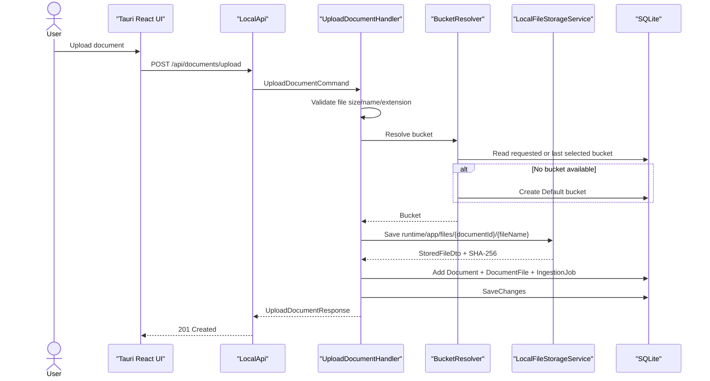
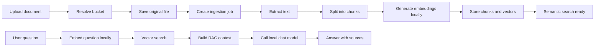
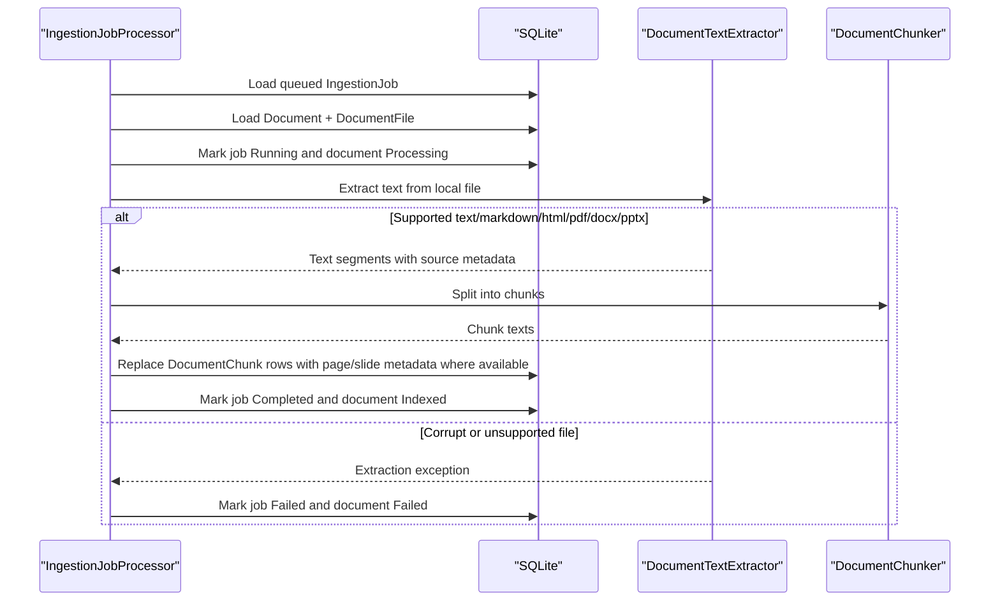

# RAG Pipeline

Localmind keeps the document flow local-first. Upload creates durable local metadata first, stores the original file under the document id, queues ingestion, and only then later parsing/chunking/embedding workers make semantic search available.

## Upload slice

Rules:

- `Document.BucketId` is always assigned for new uploads.
- Explicit missing `bucketId` is an error.
- Missing optional `bucketId` resolves to the last selected bucket, then to the system `Default` bucket.
- Files are stored predictably in `runtime/app/files/{documentId}/{originalFileName}`.

## Full RAG flow

## Ingestion MVP

Current MVP support:

- `.txt`, `.md`, `.markdown` are extracted as raw text.
- `.html`, `.htm` are extracted by stripping scripts, styles and tags, then decoding HTML entities.
- `.pdf` is extracted page by page and stores page numbers on chunks.
- `.docx` is extracted from document paragraphs.
- `.pptx` is extracted slide by slide and stores slide numbers on chunks.
- Corrupt files fail ingestion with the parsing error stored in `IngestionJob.LastError`.
