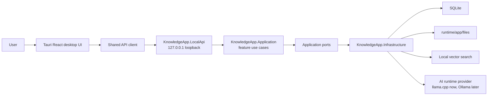

# System Overview

LocalMind runs as a portable desktop application with a local backend sidecar.

## Runtime Boundaries

- `apps/desktop` renders the UI and calls only LocalApi through typed API slices.
- `KnowledgeApp.LocalApi` owns HTTP, OpenAPI metadata, security middleware, and API envelope mapping.
- `KnowledgeApp.Application` owns feature use cases, validation, `Result<T>`, ports, and mappers.
- `KnowledgeApp.Domain` owns entities, enums, and value objects without infrastructure references.
- `KnowledgeApp.Infrastructure` implements SQLite, local file storage, ingestion processing, vector search, embeddings, runtime providers, diagnostics, and sync skeletons.
- `KnowledgeApp.Contracts` owns public request/response DTOs used by LocalApi, OpenAPI, DocFX, and frontend mirrors.

## Local-First Defaults

Local data is stored under `runtime/app` in portable mode. LocalApi binds to loopback by default and rejects non-local access unless security options are explicitly changed. AI runtime calls stay behind provider adapters so the desktop UI does not depend on llama.cpp, Ollama, or any runtime-specific port.
