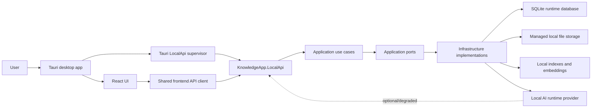
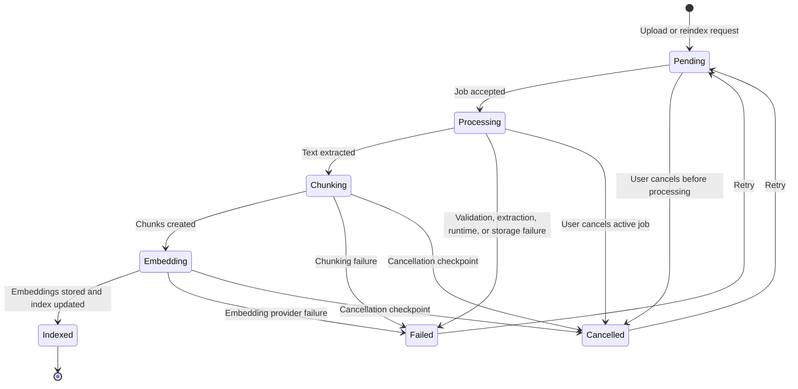
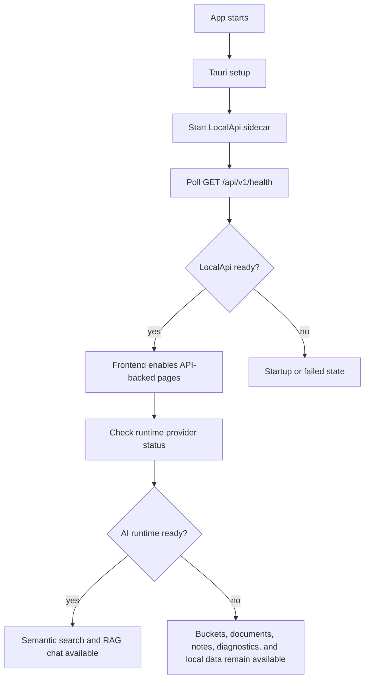
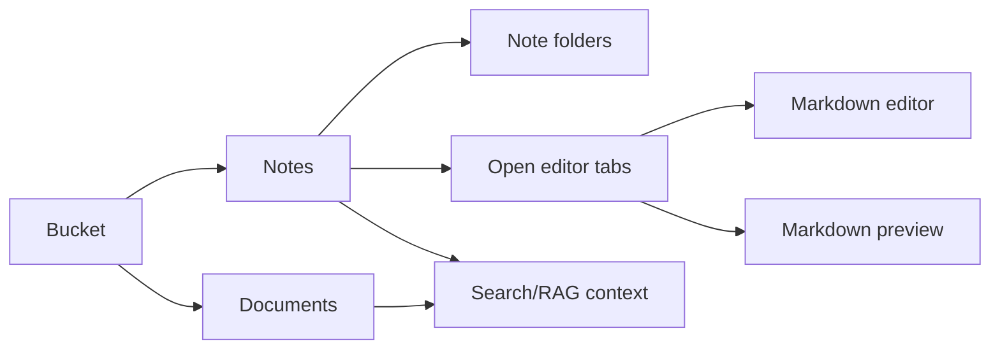
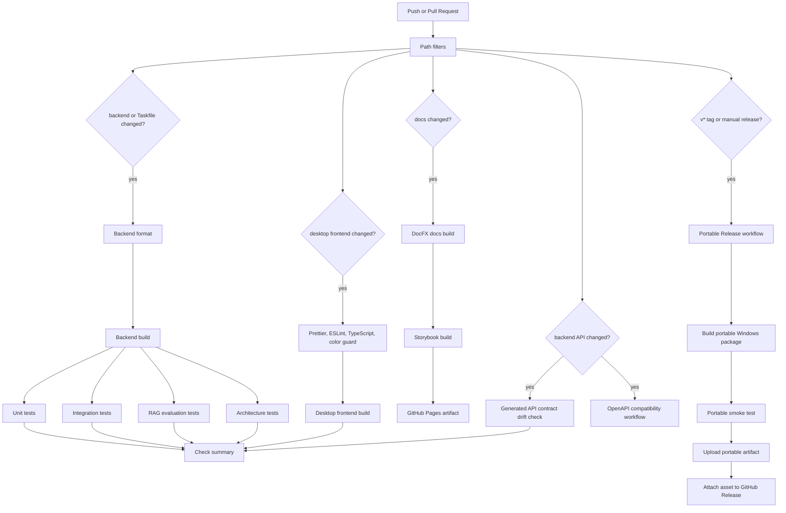
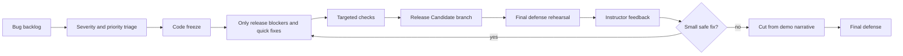

# LocalMind Release Candidate notes

This document describes the current LocalMind Release Candidate on `master` after the stabilization merges `#87`, `#88`, and `#89`.

The goal of this release is not to expand scope. The goal is to present a stable local-first MVP that can be defended, demonstrated, tested, and packaged with a clear fallback plan.

## Release summary

LocalMind is an offline-first desktop knowledge application for local documents, notes, semantic search, and RAG chat. This Release Candidate focuses on the core defense scenario:

1. start the Tauri desktop shell and LocalApi sidecar;
2. create or select a bucket;
3. upload a supported document;
4. observe the ingestion job lifecycle;
5. organize notes in the local vault;
6. search or chat with local content when the AI runtime is available;
7. show safe degraded states when local dependencies are missing;
8. explain the architecture and CI/release pipeline clearly.

## What changed at a glance

| Area | User-visible result | Engineering result |
| --- | --- | --- |
| Desktop startup | The app coordinates LocalApi readiness through the Tauri supervisor instead of depending on eager frontend calls. | LocalApi process lifecycle, readiness events, and shutdown behavior are centralized in Rust/Tauri. |
| Ingestion | Documents expose the documented lifecycle states and controls: `Pending`, `Processing`, `Chunking`, `Embedding`, `Indexed`, `Failed`, and `Cancelled`. | Ingestion jobs are polled through LocalApi and mapped to document rows with progress, current step, retry, and cancel affordances. |
| Buckets | Bucket metadata is readable and rename no longer loses persisted descriptions. | `syncStatus` is formatted through a frontend mapper and rename requests preserve the current description. |
| Notes | The note workspace is more complete, with vault navigation, note folders, tabs, editing, preview, and drag/drop organization. | Backend note-folder contracts, handlers, persistence, and frontend vault explorer models were added or hardened. |
| Search and chat filters | Users can scope search and chat to buckets, documents, content type, and metadata-like filters. | Retrieval filter parsing was moved into shared helpers and API contracts were regenerated. |
| Runtime setup | Local AI setup has clearer progress and runtime state behavior. | Runtime setup coordination, provider status, model store handling, and process management were refined. |
| Themes and UI polish | The desktop app has clearer visual states, alternative themes, improved cards, badges, tooltips, and page layout polish. | Theme tokens and provider wiring were expanded without bypassing shared UI primitives. |
| Documentation | The final defense rehearsal plan is now part of the docs site. | DocFX TOC includes the rehearsal page and generated docs build succeeds. |
| CI | Checks are separated by changed area and publish useful test, coverage, docs, OpenAPI, and release artifacts. | GitHub Actions use path filters, reusable setup actions, Taskfile commands, and dedicated workflows. |

## High-level product flow

Important boundary:

- React never calls SQLite, file storage, vector indexes, Ollama, llama.cpp, or runtime sidecars directly.
- The desktop app talks to local backend functionality through `KnowledgeApp.LocalApi`.
- Tauri owns desktop/system integration and LocalApi process supervision.
- LocalApi owns API contracts, request validation, LocalApi security, and response envelopes.

## Ingestion lifecycle

The most important MVP workflow is now explicit in the UI. Uploading a document creates an ingestion job. The job can move through the documented lifecycle and the Documents page can display job progress and actions.

User-facing result:

- The Status filter exposes `Pending`, `Processing`, `Chunking`, `Embedding`, `Indexed`, `Failed`, and `Cancelled`.
- Document rows display the latest job status, `currentStep`, and `progressPercent`.
- Failed jobs expose retry when `canRetry` is true.
- Active jobs expose cancel when `canCancel` is true.
- Missing AI runtime is shown as a controlled failure/degraded mode instead of an unexplained crash.

## Runtime and degraded mode

This is the main defense point for resilience: LocalMind is local-first, not cloud-first. The desktop product remains useful when the AI runtime is missing, and AI-dependent features can explain their unavailable state.

## Notes vault and document organization

The notes workspace now supports a more realistic local knowledge workflow:

Key additions:

- note folders and tree contracts in LocalApi;
- frontend vault explorer model and UI;
- drag/drop payload helpers;
- markdown editor, preview, toolbar, tab handling, and properties panel;
- tests for tab behavior and drag payload decisions.

## Bucket fixes included in the Release Candidate

Two visible bucket defects were corrected:

1. `syncStatus` no longer renders as raw numeric enum values. The UI maps values such as `0` to `Local only`.
2. Bucket rename no longer sends `description: null` by default. The existing description is preserved unless a future description editing flow explicitly changes it.

These fixes reduce demo risk because Buckets is a primary page and silent metadata loss is hard to explain during a defense.

## CI and release pipeline

The CI system is split into purpose-built workflows. The release branch and PR should be judged by the workflows that match its changed files.

### CI workflows

| Workflow | Trigger | Purpose |
| --- | --- | --- |
| `Check` | Push, PR, manual dispatch | Main quality gate: backend format/build/tests, frontend checks/build, generated API contract drift. |
| `Docs` | Push to `master`, PR, manual dispatch | Builds DocFX docs, Storybook, and GitHub Pages artifact. |
| `OpenAPI compatibility` | Backend/API PR or manual dispatch | Generates base/revision OpenAPI specs and fails on breaking `/api/v1` changes. |
| `Portable Release` | `v*` tag or manual dispatch | Builds and smoke-tests a Windows portable artifact, then uploads it. |

## Release stabilization flow

Code freeze means:

- no new features;
- no broad refactors;
- no risky redesigns;
- only bug fixes, release prep, documentation, and stability work.

## Validation used for recent stabilization

Recent focused checks included:

- `pnpm.cmd --filter desktop test -- syncStatus`
- `pnpm.cmd --filter desktop test -- bucketRenameRequest`
- `pnpm.cmd --filter desktop test -- ingestionLifecycle`
- `pnpm.cmd --filter desktop typecheck`
- `pnpm.cmd --filter desktop lint`
- `task -t .config/task/Taskfile.yml docs:build`
- pre-commit formatting checks

Full CI still remains authoritative for a PR or release tag.

## Demo narrative

Recommended final defense script:

1. Problem and context.
   - Local knowledge is scattered across documents and notes.
   - Cloud tools can be unavailable, costly, or unsuitable for private files.
   - LocalMind keeps the workflow local-first.
2. Live demo.
   - Start the app.
   - Show LocalApi readiness.
   - Create/select a bucket.
   - Upload a document.
   - Show ingestion lifecycle/progress/actions.
   - Create/edit notes.
   - Search or chat if the AI runtime is ready.
   - Show graceful degraded mode if AI runtime is missing.
3. Architecture.
   - Tauri supervises the LocalApi sidecar.
   - React uses shared API slices only.
   - LocalApi owns contracts and envelopes.
   - Application ports isolate use cases from infrastructure.
   - SQLite, files, indexes, and runtime assets stay local.
4. Team conclusions.
   - Stable local-first MVP was prioritized over unfinished scope.
   - Code freeze protects the demo.
   - Remaining work can continue after defense.

## Plan B for defense risks

| Risk | Response |
| --- | --- |
| LocalApi fails to start | Restart once. If still failing, show prepared screenshots or recorded demo and explain the supervisor/readiness model. |
| AI runtime is missing | Demonstrate local flows and explain degraded mode. Do not claim live AI flows were executed. |
| SQLite runtime is broken | Switch to a clean prepared runtime directory and restart. |
| Internet is unavailable | Continue offline. LocalMind does not require internet for the core MVP flow. |
| Demo data is missing | Use prepared `.txt` sample files and a clean demo bucket. |
| CI is still running | Explain the workflow gates and show the latest completed relevant check. |

## Known scope boundaries

The Release Candidate intentionally does not claim:

- production-ready remote sync between devices;
- full cloud account management;
- OCR for scanned PDFs;
- signed installer and auto-update;
- mobile or web clients;
- complete AI runtime setup for every machine.

These remain follow-up release tasks, not blockers for the local-first MVP defense.

## Links

- Repository: <https://github.com/Ermolz69/localmind-rag>
- Kanban board: <https://github.com/users/Ermolz69/projects/2>
- Final defense rehearsal page: [Final defense rehearsal plan](final-defense-rehearsal.md)
- Demo 3 test plan: [Third demo test plan](demo-3-test-plan.md)
