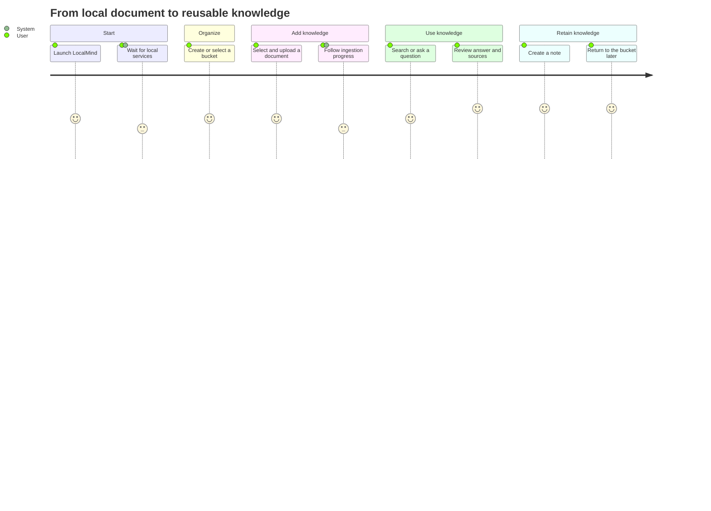

# User Journey Map

## Journey Goal

This map describes the key LocalMind MVP scenario: a user launches the portable desktop application, adds a local document to a knowledge bucket, waits for local processing, finds an answer grounded in that document, and saves a personal note.

The journey validates the main product promise: private documents become searchable and useful without cloud upload, manual backend setup, or a permanent internet connection.

## Primary Persona

**Name:** Anna, university student

**Context:** Anna has lecture notes, articles, and course materials in PDF, DOCX, PPTX, Markdown, and text files. The files are stored in different folders, and she regularly spends time reopening documents to find one fact.

**Goals:**

- Organize course materials by subject.
- Find information by meaning rather than only by exact keywords.
- Ask questions and receive answers based on her own documents.
- Keep useful conclusions next to the source materials.
- Work offline and keep private materials on her computer.

**Needs:**

- A portable application that starts without technical setup.
- Clear upload and processing feedback.
- Trustworthy answers with identifiable sources.
- Understandable recovery actions when processing fails.

**Main concerns:**

- Whether private documents leave the device.
- Whether the app is ready after launch.
- Whether a document was processed successfully.
- Whether an AI answer is supported by the uploaded material.

## Scenario

Anna is preparing for an exam. She wants to add a lecture PDF to a course bucket, ask a question about the lecture, verify the cited passage, and save the answer as a note for later revision.

**Starting point:** LocalMind is available as a portable Windows package.

**Successful outcome:** The document is indexed locally, Anna receives a grounded answer with a source reference, and a related note is stored in the selected bucket.

## Journey Overview

The scores represent the expected user sentiment from `1` (very negative) to `5` (very positive).

## Detailed Journey

| Stage | User goal | User actions | System response and touchpoints | User thoughts and emotions | Potential pain points | MVP opportunities and safeguards |
| --- | --- | --- | --- | --- | --- | --- |
| 1. Launch | Start working without technical setup | Opens the portable LocalMind executable | Tauri opens the desktop UI, starts or connects to LocalApi, creates runtime folders, and prepares SQLite | “I hope this works immediately.” Cautious, then reassured | Slow startup; blank screen; LocalApi unavailable; unclear service state; antivirus warning for a portable executable | Show a startup state instead of an empty UI; display LocalApi health; explain recoverable startup failures; provide a retry action; avoid requiring Docker, CLI commands, or manual migrations |
| 2. Confirm readiness | Understand whether local features are available | Checks the home or diagnostics state | UI shows LocalApi, storage, ingestion, and AI runtime status | “Can I upload files now? Will chat work offline?” Uncertain if statuses are ambiguous | Technical provider names; runtime status without consequences; AI runtime unavailable but document features still usable | Use plain-language states such as `Ready`, `Starting`, and `Needs setup`; distinguish core document readiness from optional AI readiness; state that files remain local |
| 3. Organize a subject | Create a clear place for related materials | Creates a “Machine Learning” bucket or selects an existing bucket | Bucket appears in navigation and becomes the active upload context | “Now these files will not get mixed with other courses.” In control | Bucket creation hidden; duplicate names; no selected bucket; uncertainty about where the upload will go | Keep bucket creation close to navigation and upload; visibly mark the selected bucket; fall back to `Default` when no bucket is selected; validate names with an actionable message |
| 4. Choose a document | Add useful source material | Opens the file picker or drags a lecture PDF into the app | UI shows selected file name, type, size, destination bucket, and upload action | “Is this format supported? Is the file uploaded anywhere?” Interested but privacy-conscious | Unsupported format; oversized or corrupted file; accidental wrong bucket; unclear privacy model | List supported formats near the picker; validate name, extension, and size before processing; confirm the destination bucket; state that processing is local; sanitize file names safely |
| 5. Upload | Store the original file safely | Confirms upload | LocalApi stores the original under managed runtime storage, creates document metadata, and queues a `Pending` ingestion job | “The file is added. What happens next?” Hopeful | Upload appears frozen; duplicate clicks; network-style errors despite a local app; file saved but job not visible | Show immediate acknowledgement; disable duplicate submission while active; create a visible document row and job; preserve the original if later processing fails |
| 6. Process and index | Know when the document is ready | Watches progress or continues using the app | Job moves through `Pending`, `Processing`, `Chunking`, `Embedding`, and `Indexed`; UI shows progress and current step | “I can wait if I know it is progressing.” Neutral during short waits, frustrated during silent waits | Progress stalls; large files take time; extraction quality varies; scanned PDF produces little text; AI embedding runtime unavailable; raw technical errors | Show current step, progress, and timestamps; allow safe cancellation; use sanitized stable errors; offer retry for failed or cancelled jobs; explain that OCR is outside MVP; keep the UI responsive |
| 7. Recover from failure | Fix the problem without losing work | Reads the failure, retries, cancels, or chooses another file | Failed job includes a stable error code, safe message, retry count, and diagnostic operation id | “Tell me what I can do next.” Frustrated but willing to recover | Generic “Something went wrong”; stack traces; original file lost; retry repeats forever; no distinction between unsupported content and temporary runtime failure | Provide a specific next action; retain the original file; expose `Retry` only when valid; link to diagnostics by operation id; never expose internal paths, SQL details, or process output |
| 8. Find information | Locate a relevant fact in indexed content | Filters by bucket and enters a search query or opens RAG chat | LocalApi searches local chunks and returns ranked snippets or builds a grounded answer | “Can it understand what I mean, not just exact words?” Curious | Document not indexed yet; no results; unrelated ranking; query covers the wrong bucket; AI runtime unavailable | Disable or explain actions until indexing completes; show the active search scope; provide useful empty states; keep semantic search and chat behind LocalApi provider abstractions |
| 9. Verify the answer | Decide whether the result can be trusted | Reads the answer, opens source references, and compares the passage | UI shows document title, relevant snippet, score where useful, and page or slide reference when available | “I trust this only if I can see where it came from.” Focused and confident when evidence is clear | Hallucinated answer; missing citation; vague source title; page reference unavailable; source passage hard to inspect | Require source references for grounded answers; clearly separate generated answer from source text; show page or slide metadata when extractors provide it; state when evidence is insufficient |
| 10. Save a note | Preserve the useful conclusion | Creates a note with a title and markdown content in the active bucket | Note is stored locally and appears in the notes list with bucket context | “I can reuse this during revision.” Satisfied | Draft lost; bucket context missing; saving state unclear; accidental deletion | Show save progress and success; preserve edits on recoverable failures; keep notes in the shared bucket model; require confirmation for destructive actions |
| 11. Return later | Resume work with minimal effort | Reopens LocalMind and selects the bucket | Local data, documents, statuses, and notes are restored from SQLite and managed storage | “Everything should still be here.” Confident if state is preserved | Missing recent selection; stale job status; moved portable folder; corrupted local state | Restore the last useful context where safe; reconcile active job state on startup; provide diagnostics and clear recovery guidance; never silently discard local data |

## Emotional Curve

| Moment | Expected emotion | Design implication |
| --- | --- | --- |
| First launch | Cautious optimism | Make readiness visible and avoid technical setup language |
| Bucket creation | Control | Keep organization simple and reversible |
| Upload confirmation | Anticipation | Confirm local storage and destination immediately |
| Ingestion wait | Uncertainty | Show meaningful progress and current processing step |
| Processing failure | Frustration | Explain the cause safely and provide a direct recovery action |
| Relevant result | Relief | Make the result easy to scan |
| Source verification | Trust | Keep citations close to claims |
| Note saved | Satisfaction | Confirm persistence and bucket context |

## Critical Pain Points

### 1. Unclear startup readiness

The desktop shell can appear before LocalApi or the local runtime is ready. Without a visible startup state, the user may interpret temporarily unavailable controls as a broken application.

**Required response:** show readiness, retry, and degraded-mode information in plain language.

### 2. Silent or opaque ingestion

Extraction, chunking, and embedding may take noticeably different amounts of time depending on document type and hardware.

**Required response:** display the durable job status, current step, progress, and safe failure reason. Keep the original upload available for retry or future reindexing.

### 3. Unsupported or low-quality source content

Scanned PDFs, unusual layouts, corrupted office documents, and unsupported encodings can produce weak or empty text.

**Required response:** validate supported file properties early, report extraction limitations clearly, and avoid claiming that an unusable document was indexed successfully.

### 4. AI runtime unavailable

The local document library and notes may be ready while semantic embeddings or chat are unavailable.

**Required response:** communicate partial availability. Do not block basic document and note workflows because an optional AI capability is not ready.

### 5. Low trust in generated answers

An answer without a recognizable document, snippet, page, or slide reference is difficult to verify.

**Required response:** ground answers in retrieved chunks, expose source metadata, and communicate when the available evidence is insufficient.

### 6. Fear of data leaving the device

Users choosing a local-first product may abandon the workflow if upload language resembles cloud storage.

**Required response:** consistently explain that files, indexes, notes, and supported AI processing remain on the user's machine by default.

## Alternative and Failure Paths

### Unsupported file

1. The user selects an unsupported extension or invalid file.
2. The UI rejects it before or during upload with a standard API error.
3. The message names supported formats and does not create a misleading indexed state.
4. The user chooses another file.

### Ingestion failure

1. The document is stored, but extraction or indexing fails.
2. The document shows `Failed`, a sanitized reason, retry availability, and an operation id.
3. The user retries after correcting the dependency or selects a different document.
4. The original file remains available.

### AI unavailable

1. The document can be uploaded and chunked, but embedding or chat capability is unavailable.
2. The UI shows which local features still work.
3. The user can manage documents and notes while the runtime is configured or restarted.
4. Search/chat becomes available after provider recovery without re-uploading the source unnecessarily.

### No relevant evidence

1. The user asks a question that is not answered by the selected bucket.
2. The system avoids inventing a confident answer.
3. The UI reports insufficient evidence and shows any weak matches separately.
4. The user changes the bucket scope, reformulates the question, or uploads another source.

## Success Metrics

| Metric | MVP target |
| --- | --- |
| First-launch completion | User reaches a ready document workspace without external setup |
| Time to first upload | User can begin upload within 2 minutes of first launch |
| Upload clarity | User can identify the destination bucket and processing state without opening diagnostics |
| Ingestion visibility | Every uploaded document has a visible lifecycle status and actionable failure state |
| Recovery | A failed or cancelled eligible job can be retried without reselecting the original file |
| Answer traceability | Grounded answers include at least one identifiable source reference when evidence exists |
| Privacy comprehension | User can determine from the UI or product documentation that normal document processing is local-first |
| Knowledge retention | User can save and later reopen a note in the relevant bucket |

## Requirements Traceability

| Journey stages | Related user stories |
| --- | --- |
| Launch and readiness | US-01, US-02, US-03, US-04, US-22 |
| Bucket organization | US-05, US-06, US-07 |
| Upload and validation | US-09, US-10 |
| Extraction and indexing | US-11, US-12, US-13, US-14 |
| Search and grounded answers | US-19, US-20, US-21 |
| Notes and return visit | US-15, US-16, US-17 |

## MVP Design Priorities Derived from the Journey

1. Make application and runtime readiness understandable before enabling dependent actions.
2. Keep the selected bucket visible during upload, search, chat, and note creation.
3. Treat ingestion as a visible, durable lifecycle rather than a hidden upload side effect.
4. Preserve user data and provide recovery actions when extraction or runtime dependencies fail.
5. Show evidence beside generated answers so users can verify important claims.
6. Communicate local-first privacy and partial offline capability consistently.

