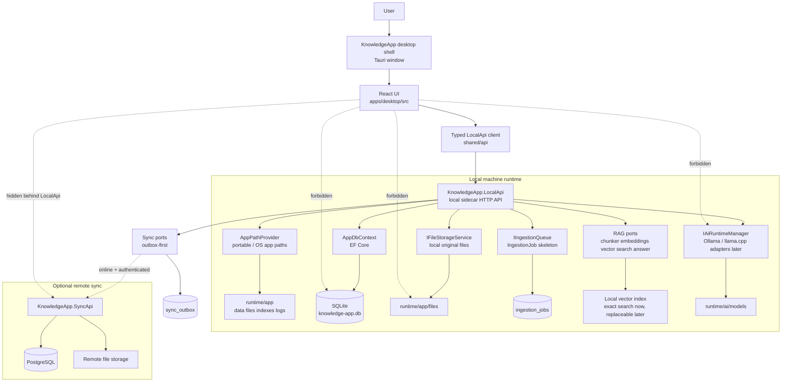
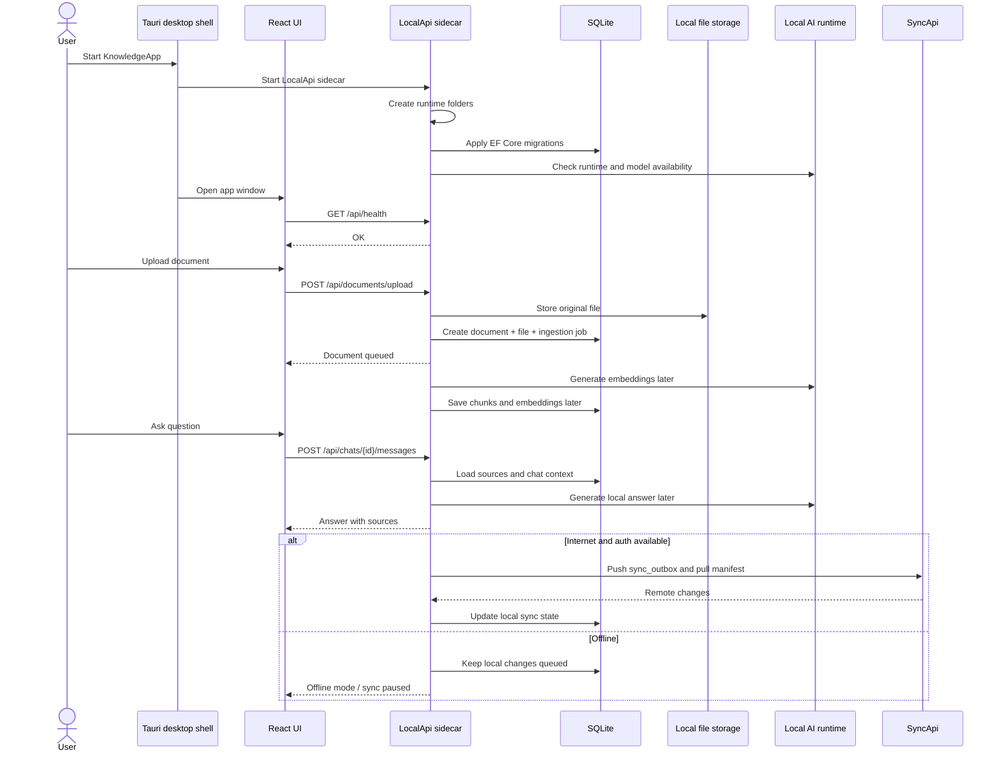
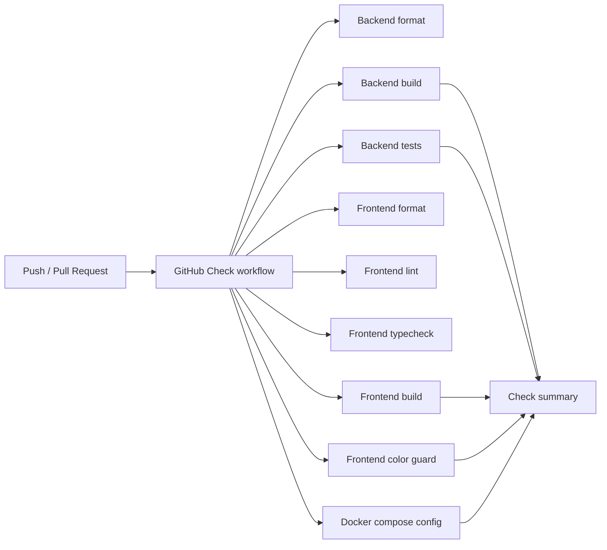

# localmind v0.1.0 - Base Architecture

This first release is the architectural foundation for `localmind-rag`. The goal is to make the repository understandable, buildable, testable, and ready for the next implementation stages without pretending the full product is complete.

## What This Release Means

`v0.1.0` is a base platform release:

- The monorepo shape is defined.
- Backend projects and dependencies are initialized.
- Frontend desktop scaffold is initialized.
- Local runtime folders and SQLite persistence are initialized.
- CI checks are split and readable.
- Portable-preview packaging exists.
- Documentation explains how the system should interact.

It is the “good skeleton” release, not the finished Knowledge App.

## Current Component Interaction

## Intended Runtime Flow

## Build And Quality Gate Diagram

## What Was Actually Implemented

- Solution and project scaffolding for backend layers.
- Central .NET package management and strict build settings.
- Local SQLite persistence with initial migration.
- Runtime path resolution for portable folders.
- LocalApi health and skeleton endpoint surface.
- Basic domain, contract, and application port types.
- Desktop UI shell with app navigation, pages, semantic theme tokens, and typed API client.
- CI workflows and portable-preview release workflow.
- Repository hygiene and Docker ignore rules.

## What Comes Next

1. Move LocalApi endpoint logic into Application use cases.
2. Implement real file upload flow in the desktop UI.
3. Implement document parsing and ingestion workers.
4. Implement chunking, embeddings, and replaceable vector index.
5. Implement local AI runtime manager for Ollama and llama.cpp.
6. Implement RAG answers with source references.
7. Implement notes and note links.
8. Implement remote sync auth, devices, manifest, upload/download, and conflict handling.
9. Wire full Tauri native portable packaging with `KnowledgeApp.exe`.
